# Trabajo_extra
## 1.PLANTEAMIENTO DEL PROBLEMA
Investigar las funcionalidades del  IDE de programación VISUINO desarrollando un  programa  que controle una pantalla LCD de 16 líneas y 2 columnas
## 2.OBJETIVOS
Realizar un tutorial que documente el desarrollo de un programa en el IDE VISUINO utilizando las funcionalidades de una pantalla LCD.
### General:
  Realizar un tutorial en la plataforma de Visual Visuino con componentes de video.
### Específicos:
 Explicación del ambiente de Desarrollo de  VSUINO
Diseño y desarrollo de un programa que utilice una pantalla LCD de 16 líneas y 2 columnas
Realizar un video tutorial del desarrollo del programa
## 3.ESTADO DEL ARTE
VISUINO es un software innovador de la casa de Software Mitov Software. Es un entorno de programación visual para placas Arduino y Compatibles. La aplicación está diseñada para el manejo de elementos gráficos utilizando el método   arrastrar y soltar. 
El ambiente de desarrollo es un generador de código, es decir una vez realizado el proyecto interconectando los elementos gráficos, este puede ser ejecutado directamente en la placa seleccionada sin necesidad de que el diseñador del programa adicione ninguna línea de código. De esta manera se reduce de manera significativa el tiempo de desarrollo de un programa por su diseño simplificado y al no necesitar de profesionales especializados en el manejo del código 
### Tema: Tutorial para simular arduino con componentes de video.
## 4.MARCO TEÓRICO
Elementos de VISUINO

Barra de Herramientas, en esta se encuentran ubicadas las funciones principales del IDE,

Entre las funciones más importantes de esta barra están el envío del programa directo a la Placa o el envío al IDE de Arduino.

Barra de Navegación, en esta se encuentra nuestra placa de Arduino en conjunto con todos los elementos gráficos que componen nuestro proyecto. Estos elementos se los ven de manera resumida en el tamaño.

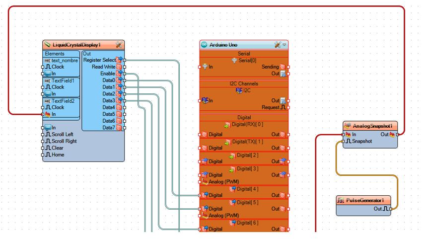

Panel de Propiedades, Cada uno de los elementos gráficos que se incluyen en el proyecto puede hacer uso del Panel de Propiedades, aquí se despliegan las propiedades intrínsecas de cada elemento.

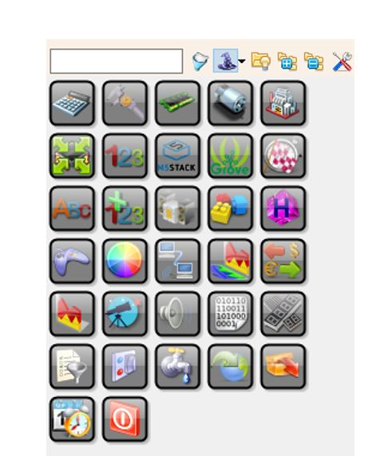

Menú de Componentes, Está compuesta de todos componentes gráficos que dispone y pone a disposición el IDE de VISUINO, por ejemplo, aquí se encuentra la Pantalla LCD que vamos a utilizar en este proyecto.

Área de Trabajo, En esta área realizamos la interconexión de todos los elementos gráficos de nuestro proyecto, está la Placa Arduino y los componentes del Proyecto interconectados mediante líneas que representan el flujo de datos.

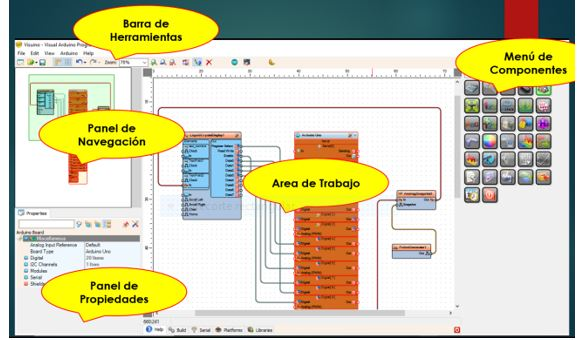

A continuación, se muestra una gráfica con todos los elementos del IDE VISUINO.

## 5. LISTA DE COMPONENTES
Para la construcción de un programa que utilice una pantalla LDC de 16 líneas y 2 columnas se utilizaron elementos de Software y Hardware que a continuación se enumeran y detallan.
Elementos de Software:
•	Para el diseño esquemático de la solución: Programa FRITZING
•	Para el diseño de la Aplicación: IDE VISUINO
•	Para la compilación y carga del programa IDE de ARDUINO
FRITZING
Es una iniciativa de hardware de código abierto que hace que la electrónica sea accesible como material creativo para cualquier persona. Es una herramienta de software, un sitio web comunitario y de servicios en el espíritu de Procesamiento para Arduino, fomentando un ecosistema creativo que permite a los usuarios documentar sus prototipos, compartirlos con otros, enseñar electrónica en un aula y diseñar y fabricar pcbs profesionales.
En el Anexo 1 se puede observar el diseño esquemático del Proyecto.
IDE de ARDUINO
El software Arduino de código abierto (IDE) hace que sea fácil escribir código y subirlo a la placa. Se ejecuta en Windows, Mac OS X y Linux. El entorno está escrito en Java y se basa en el procesamiento y otro software de código abierto.
Este software se puede usar con cualquier placa Arduino.
Elementos de Hardware:

*	Una Placa Arduino UNO
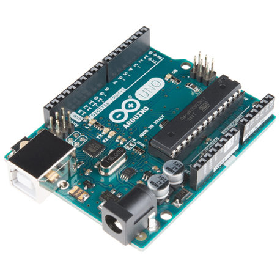

*	Pantalla LCD 16x2
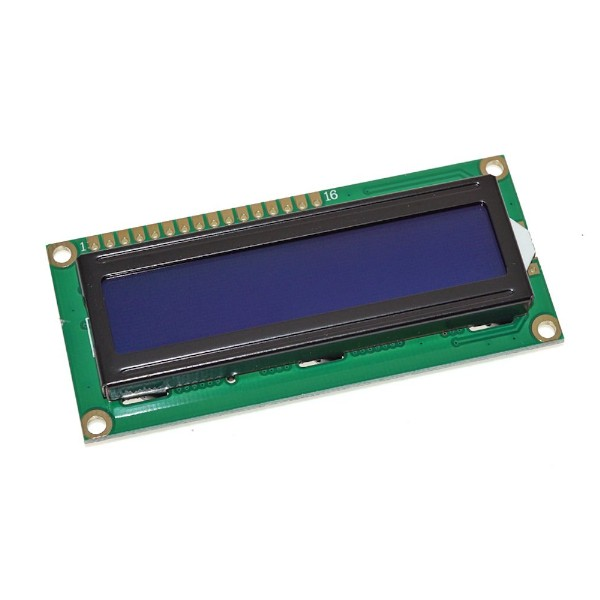

*	Un Pulsador Digital.
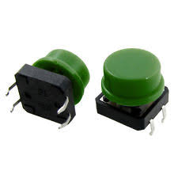

*	Varios Cables de conexión
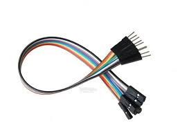

*	2 resistencias de 300KOhmios
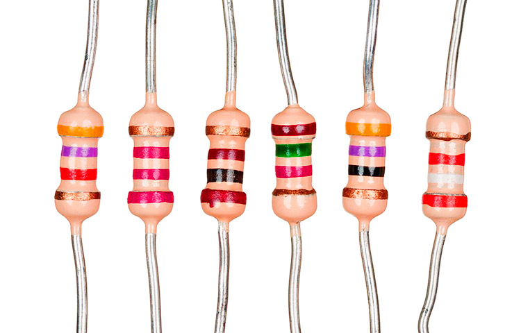

Placa ARDUINO UNO

En el Anexo 2 se puede observar una gráfica del circuito interconectado y en funcionamiento.
## 6.Diseño del Programa en VISUINO
Para construir la aplicación que utilice una pantalla LCD se ha tomado como idea el desarrollo de un CONTADOR DE VUELTAS QUE SE MUESTRE EN UNA PANTALLA LCD.
Explicación de la Solución:
El programa muestra en la primera línea de  la Pantalla el nombre del desarrollador de forma permanente.
En la segunda línea de la Pantalla se muestra un contador (número) el cual se incrementa en uno cada vez que se presiona el pulsador digital.
Para implementar esta explicación se utilizó los siguientes elementos gráficos del VISUINO:
•	Placa Arduino Uno.
•	Un LiquidCrystalDisplay
•	Un Counter.
La interconexión de estos elementos es la siguiente:
En la pantalla LCD insertamos dos elementos un TextField (nombre=Programador) y un IntegerField (nombre=Contador), el primero se utiliza para desplegar el nombre del Programador y el segundo para desplegar el contador.
Para enviar la información a la pantalla LCD conectamos los Pines 4, 5, 6,7 del Arduino a los pines Data4, Data5, Data6 y Data7 de la Pantalla LCD. 
Para las señales de control de la pantalla Conectamos los pines  Register Select y Enable del LCD a los pines 8 y 9 del Arduino respectivamente
Para implementar el contador conectamos el Pin 3 del Arduino (en este pin está conectado el Pulsador digital) a la línea In del Counter, y la salida Out del Counter le conectamos al línea In del IntegerField (Contador).
En el Anexo 3 se presenta la Gráfica de la Solución.
## 7. APORTACIONES
Para implementar la misma solución se lo puede realizar utilizando directamente el IDE de Arduino y con el siguiente Sketch de solamente 35 líneas:

#include <LiquidCrystal.h>
int VO = 3; int RS = 8; int E = 9; int D4 = 4; int D5 = 5; int D6 = 6; int D7 = 7;
LiquidCrystal lcd (RS, E, D4, D5, D6, D7);
int contador = 0; int pulsos = 10; 
void setup() {
  analogWrite(VO, 50);
  lcd.begin(16, 2);
  lcd.setCursor(0, 0);
  lcd.print("Marlon Torres");
  lcd.setCursor(0,1);
  lcd.print((String)contador);
  pinMode(pulsos, INPUT);
}
void loop(){
  if (digitalRead(pulsos)== 1){
    contador++;
    lcd.setCursor(0, 0);
    lcd.print("Marlon Torres");
    lcd.setCursor(0,1);
    lcd.print("                ");
    lcd.setCursor(0,1);
    lcd.print((String)contador);
  }
  delay(300);
}
## 8. CONCLUSIONES
La herramienta VISUINO es muy elemental y no se necesita conocimientos del lenguaje de programación para Arduino.
La cantidad de elementos Gráficos del IDE de Visuino son numerosos y se necesita un manual detallado de cada uno con sus propiedades y funcionalidades.
El código generado por la plataforma VISUINO es bastante compleja para poder realizar una modificación, sin embargo hace un buen uso de la cantidad de memoria que usa el programa.
## 9. RECOMENDACIONES
Para proyectos pequeños y proyectos educativos es una herramienta muy recomendable, sin embargo, para el Proyectos donde se utilicen elementos que necesiten una programación muy elaborada no se debería utilizar VISUINO.

No se debería utilizar VISUINO si se desea manipular el código fuente generado, la estructura es bastante compleja encadenando muchas funciones.
## 11. BIBLIOGRAFÍA:
Arduino - Software. (n.d.). Retrieved August 4, 2020, from https://www.arduino.cc/en/main/software
Fritzing. (n.d.). Retrieved August 4, 2020, from https://fritzing.org/
Visuino - Visual Development for Arduino by Mitov Software. (n.d.). Retrieved August 4, 2020, from https://www.visuino.com/
García Cobo, J. (n.d.). Visuino, una herramienta de programación para los creadores de hardware. Retrieved August 2, 2020, from https://www.hwlibre.com/visuino-una-herramienta-de-programacion-para-los-creadores-de-hardware/
## 12. ANEXOS
Anexo 1:
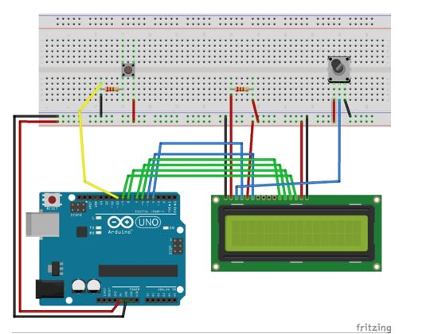
Diseño esquemático
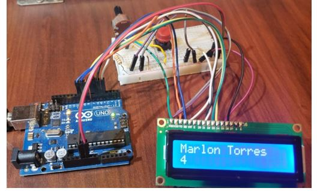
Anexo 2:
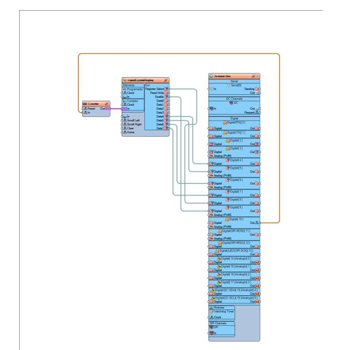
Anexo 3:

