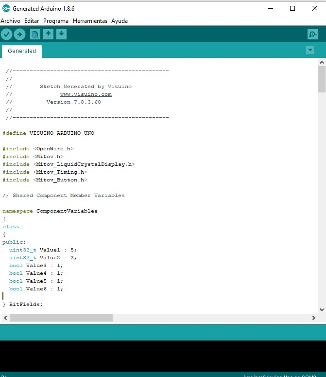

# Trabajo_extra
## 1.PLANTEAMIENTO DEL PROBLEMA

## 2.OBJETIVOS

### General:
  Realizar un tutorial en la plataforma de Visual Visuino con componentes de video.
### Específicos:
  Investigar las funcionalidad de la plataforma Visuino.
  Exponer una breve descripcion sobre el tema mediante un video.
## 3.ESTADO DEL ARTE
### Tema: Tutorial para simular arduino con componentes de video.
## 4.MARCO TEÓRICO
El hardware libre nos permite crear muchos gadgets e inventos que se adecuan a solucionar nuestros problemas, pero el hardware es una solo parte de un todo. El software sería la otra parte y aunque no representa un grna problema, lo cierto es que para los amantes del hardware, el programar es una parte lenta y a veces aburrida. Con estos planteamientos nace Visuino, una herramienta de programación visual, similar a a Visual Studio pero enfocada a desarrollar para Arduino.
Visuino incorpora bastantes cosas positivas como la preselección de la placa Arduino con la que desarrollaremos, la selección de componentes que cargaremos y la creación del programa según diagramas lo que nos permite ir más rápidos con la creación de nuestros programas.

Esto está muy bien, pero Visuino aún no llega al IDE oficial de Arduino. Por un lado Visuino sólo está disponible para Windows, frente las otras plataformas para las que el IDE de Arduino si que está. Además Visuino es de pago, algo que no ocurre con el IDE de Arduino. La empresa que ha creado Visuino se llama Mitov Software, una empresa que si bien apoya al proyecto Arduino, no es una empresa oficial por lo que a la hora de programar no es lo mismo que el IDE de Arduino que si es oficial.

Visuino por el momento sólo está para Windows
Aún así, hemos de reconocer que Visuino plantea un nuevo paradigma en la programación del hardware libre ya que su manera de funcionamiento agiliza bastante el trabajao del amante del hardware y por otro lado nos permite copiar y reutilizar código que en algunos casos otras herramientas no hacen. Desde luego a Visuino le queda mucho por hacer si quiere ser la herramienta que use la mayoría de los programadores, pero desde luego no va por mal camino(García Cobo, n.d.)
## 5. LISTA DE COMPONENTES
Lo s componentes utilizados son los siguientes: plataforma Visuino, IDE Arduino,Placa Arduino UNO,Pantalla LCD de16 columnas y 2 líneas, Pulsador digital, 2 resistencias de 10k ohmios, Protoboard y cables de conexión
## 6. MAPA DE VARIABLES
## 7. APORTACIONES
## 8. CONCLUSIONES
## 9. RECOMENDACIONES
## 11. BIBLIOGRAFÍA:
García Cobo, J. (n.d.). Visuino, una herramienta de programación para los creadores de hardware. Retrieved August 2, 2020, from https://www.hwlibre.com/visuino-una-herramienta-de-programacion-para-los-creadores-de-hardware/
## 12. ANEXOS

